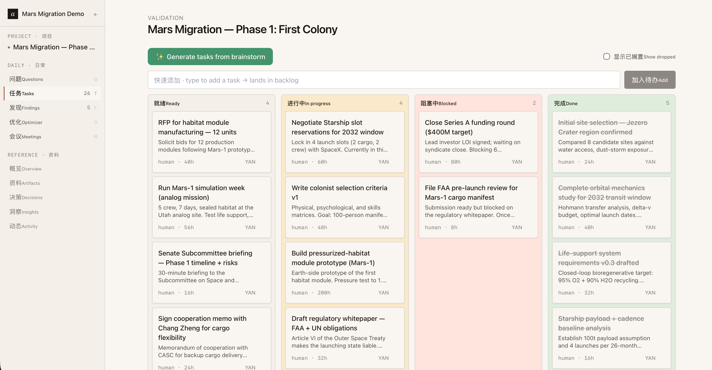
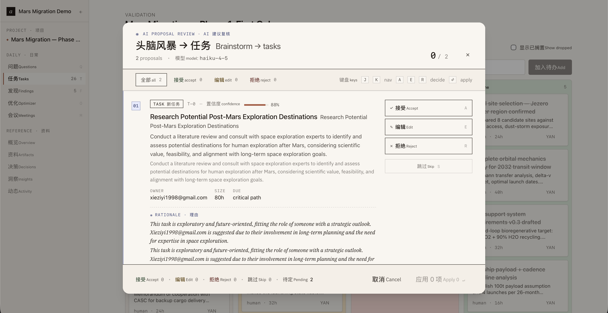
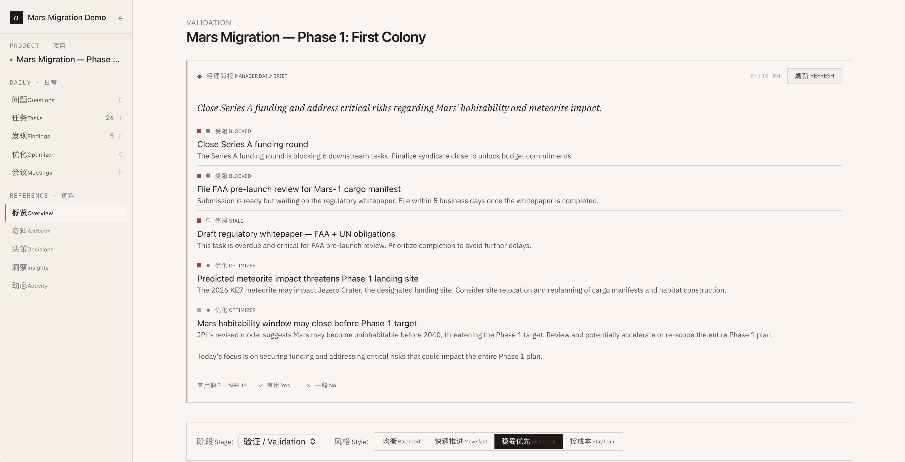
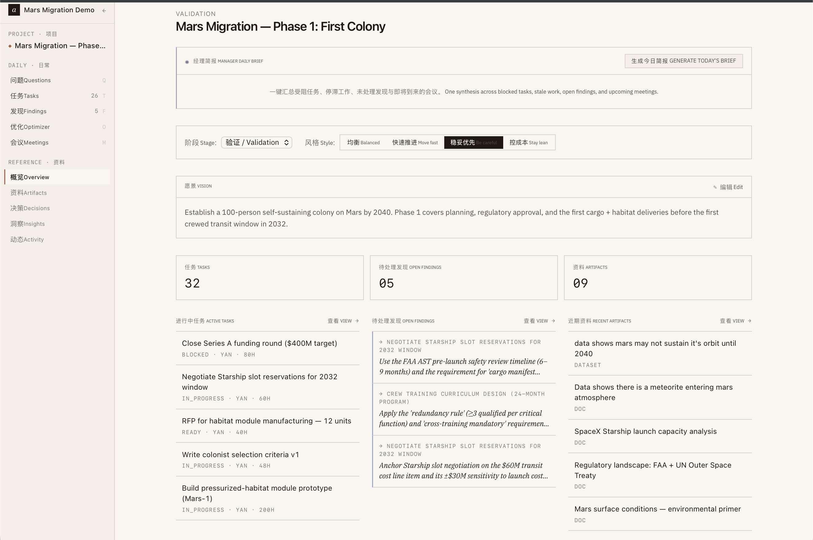

# Human-AI Project Manager

**AI that advises. Humans that decide. A feedback loop that compounds.**

Most AI tools bolt a chatbot onto existing workflows. This project inverts the stack: start from a single canonical project state, put a Manager Agent on top, and enforce one rule everywhere — *AI outputs are proposals, not actions*. Every accept, edit, and reject writes back into the agent's context, so it gets better at understanding your team's taste without any training infrastructure.

Self-hosted. Open source. Built for small teams (3–15 people) who want AI that earns trust instead of demanding it.

---



---

## Why this exists

Current PM tools treat AI as a feature. You get a "summarize" button or an "auto-assign" toggle — useful, but shallow. What's missing is a system where:

- The AI has full context of the project at every call (tasks, artifacts, decisions, team)
- Human verdicts on AI proposals feed directly into future prompts
- There's an auditable trail of every AI action and human response
- The system *doesn't* act autonomously — it suggests, humans decide

This project is a reference implementation of that idea. The code is the spec.

---

## What it looks like

### Task generation from brainstorm

Paste any amount of text — a PRD, a Slack dump, a voice memo transcript — and the Manager Agent proposes 5–15 concrete tasks with owners, estimates, and dependencies. Review each one individually.



### Daily brief

One button synthesizes blocked tasks, stale work, open findings, and upcoming meetings into a prioritized digest. Results persist across page navigation and restore automatically on return.



### Project overview



---

## Feature set

| Feature | What it does |
|---|---|
| **Task Kanban** | 6 statuses, drag-and-drop, AI-generated or manual |
| **AI Task Generator** | Brainstorm → proposed tasks → per-item Accept / Edit / Reject with reason chips |
| **Task Update via Brainstorm** | If a brainstorm expands an existing task, AI proposes an update — not a duplicate |
| **Cross-task Discovery** | Embeds artifacts, surfaces "artifact X is relevant to task Y" findings |
| **Weekly Backlog Optimizer** | Re-ranks, drops, and adds tasks based on current project state |
| **Open Question Engine** | Surfaces open questions; AI proposes answers, human redirects or accepts |
| **Manager Daily Brief** | One-click digest of everything needing attention |
| **Meeting Pre-brief + Post-summary** | AI-generated agendas and action item extraction |
| **Artifacts** | Files, links, auto-tagging, semantic search |
| **Decisions log** | Explicit log with reasoning; AI reads it to understand "why we chose this" |
| **Audit trail** | Every AI call → `manager_actions`. Debug any AI decision by starting there |

---

## The 8 design rules

These aren't preferences — they're load-bearing. Violating them breaks the feedback loop.

1. **Multi-tenant via RLS, not API checks.** Every query goes through Supabase Row Level Security. No tenant leakage by construction.
2. **AI outputs are advisory.** Nothing auto-mutates the task graph. Every output goes through Accept / Edit / Reject UI.
3. **Feedback loop is real.** Every AI call of the same type pulls recent `manager_actions` rows with human verdicts into its system prompt. This is the accumulating signal.
4. **Loop cap ≤ 3 model calls** before a human checkpoint. No runaway agentic chains.
5. **`coaching_sessions` isolation is sacred.** Even workspace owners can't read teammates' coaching sessions. Different RLS policy, never lifted.
6. **Prompt shape is cache-friendly:** `[stable_system, project_state_snapshot, user_query]`. The first two segments cache across calls.
7. **No LiteLLM.** Direct SDK calls — less magic, less maintenance surface.
8. **Schema changes are explicit migrations.** Every deviation is a versioned SQL file. No silent column additions.

---

## Stack

| Layer | Choice |
|---|---|
| Backend | Python 3.12 · FastAPI · SQLAlchemy 2 · Alembic |
| Database | Supabase Postgres + pgvector + Row Level Security |
| Auth | Supabase Auth (magic link) |
| Frontend | Next.js 14 App Router · TypeScript · Tailwind |
| LLM | Moonshot (Kimi) for generation · Qwen for embeddings |
| Storage | Supabase Storage |
| Deploy | Vercel (frontend) + Railway (backend) |

> **Swap LLMs:** Edit `backend/app/llm/routing.py` and `manager.py`. The interface (`generate` + `embed`) is provider-agnostic.

---

## Self-hosting setup

### Prerequisites
- [Supabase](https://supabase.com) account (free tier works)
- [Railway](https://railway.app) or any Python host
- [Vercel](https://vercel.com) (free Hobby plan works)
- [Moonshot / Kimi](https://platform.moonshot.cn) API key — for task generation, brief, optimizer
- [Qwen / DashScope](https://dashscope.console.aliyun.com) API key — for embeddings and discovery
- Node.js 18+, Python 3.12+, pnpm

### 1 · Supabase

1. Create a new project. Pick a region close to your team.
2. Enable `vector` extension: **Settings → Database → Extensions → vector**.
3. Copy from **Settings → API**: Project URL, `anon` key, `service_role` key, JWT secret.

### 2 · Environment

```bash
cp .env.example .env
# Fill in all values — see comments in .env.example
```

> **Database URL:** Use the **Session Pooler** connection string from Supabase (Settings → Database → Connection string → Session mode). The direct `db.<ref>.supabase.co` URL can fail on some networks.

### 3 · Backend

```bash
cd backend
python -m venv .venv && source .venv/bin/activate
pip install -e .
alembic upgrade head
uvicorn app.main:app --reload
# → http://localhost:8000
```

```bash
curl localhost:8000/healthz          # → {"status":"ok"}
curl -X POST localhost:8000/llm/ping # → model response
```

### 4 · Frontend

```bash
cd frontend
pnpm install
```

Create `frontend/.env.local`:
```
NEXT_PUBLIC_SUPABASE_URL=https://<your-ref>.supabase.co
NEXT_PUBLIC_SUPABASE_ANON_KEY=<your-anon-key>
NEXT_PUBLIC_BACKEND_URL=http://localhost:8000
```

```bash
pnpm dev  # → http://localhost:3000
```

### 5 · First run

1. Sign in at `localhost:3000/login` via magic link.
2. Create your workspace and add teammates.
3. Create a project → open the **Tasks** tab → **Generate tasks from brainstorm**.
4. Paste a paragraph about your project. Review the proposals. Reject one with a reason chip.
5. Run again — the AI will have adapted.

### 6 · Seed demo data (optional)

```bash
python scripts/seed_demo_workspace.py --email you@company.com
```

### 7 · Deploy to production

**Backend → Railway**
```bash
railway login && railway link && railway up
# Set all .env variables in Railway → Variables
```

**Frontend → Vercel**
```bash
vercel link && vercel --prod
# Set NEXT_PUBLIC_BACKEND_URL to your Railway URL in Vercel → Environment Variables
```

---

## Getting started with Claude Code

If you use [Claude Code](https://claude.ai/code), paste these prompts one at a time:

**Understand the codebase**
```
Read CLAUDE.md and give me a 10-sentence tour: key tables, how the feedback
loop works, and which files to read first to add a new AI feature.
```

**Set up from scratch**
```
I've cloned human-ai-pm and have a fresh Supabase project.
Help me apply migrations, start the backend, and confirm the frontend
connects. My Supabase URL is: <paste>
```

**Customize for your domain**
```
I'm adapting this for [your team / industry]. Update task_generation_system.md
and backlog_optimizer_system.md so the few-shot examples match my context
instead of the defaults.
```

**Add a new AI capability**
```
Add a new AI feature: [describe what you want].
Following the pattern in backend/app/api/generate.py, help me write the
system prompt, FastAPI endpoint, and frontend Accept/Edit/Reject panel.
Register it in project-tabs.tsx.
```

**Switch LLM providers**
```
I want to use [OpenAI / Anthropic / Gemini / local Ollama] instead of
Moonshot and Qwen. Update routing.py and manager.py to use the new provider
while keeping the same generate + embed interface and manager_actions audit.
```

**Debug an AI issue**
```
The [feature] AI is doing something unexpected: [describe].
Query manager_actions, reconstruct the exact prompt that was sent, and
identify what in the feedback history or project state caused this.
```

---

## Adding a new AI capability

Follow this pattern (same as every existing feature):

1. `backend/app/llm/prompts/<name>_system.md` — JSON output shape + feedback-loop instruction section
2. `backend/app/llm/routing.py` — add a `task_type` entry
3. `backend/app/api/<name>.py`:
   ```python
   rows = await llm.recent_feedback(session, project_id, "<action_type>")
   messages = llm.build_messages(stable_system, project_state + feedback_block, user_query)
   content, _ = await llm.generate(task_type="<action_type>", ...)  # auto-writes to manager_actions
   # return proposals as-is — no auto-mutation
   ```
4. Frontend panel with Accept / Edit / Reject + reason chips → `persist_*` endpoint
5. Register in `main.py` and `project-tabs.tsx`

The next call picks up new feedback automatically — no extra wiring.

---

## Repository layout

```
.
├── backend/
│   ├── alembic/versions/       ← SQL migrations (schema source of truth)
│   └── app/
│       ├── llm/
│       │   ├── manager.py      ← generate() + embed() + feedback loop
│       │   ├── routing.py      ← task_type → (provider, model)
│       │   └── prompts/        ← one *_system.md per AI feature
│       └── api/                ← one file per feature
├── frontend/
│   └── src/
│       ├── app/projects/[id]/  ← one folder per tab
│       ├── components/         ← ProposalReview, BrainstormToTasks
│       └── lib/api.ts          ← all backend calls
└── scripts/
    └── seed_demo_workspace.py
```

---

## License

MIT
